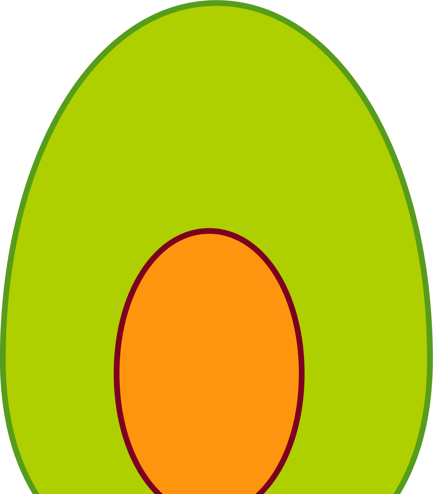

# Guac


Guac is a client library for the Slack Web and Real Time APIs in Go. Use it for
writing bots and other integrations. It's not complete but allows basic
conversation via the real time API.

The name comes from a phonetically mangled portmanteau of "Go" and "Slack"
combined with my love of Mexican food.

```
go get github.com/doozr/guac
```

For details of the Guac API see the [API reference](APIREF.md).

## Getting Started

Instantiating the client requires only a bot integration token, configured via
the *Custom Integrations* section of the Slack admin panel. Bots can discover
their own name and channels via the API itself so none of that information is
required.

```go
webClient := guac.New(token)
```

Connecting to the Real Time API is done via an existing client instance, and
opens a websocket to communicate with the Slack service.

```go
rtm, err := webClient.RealTime()
```

Close connections when they're done to clean up any goroutines that are handling
incoming messages from the Slack websocket.

```go
rtm.Close()
```

## Receiving Real Time Events

Receive events via the `Receive()` method. All events are returned from the same
function so the best way to handle them is with a type switch. this could call
handlers, push the events onto channels, or anything else.

```go
func receiveEvents(rtm slack.RealTimeClient,
                   done chan struct{},
                   messages chan guac.MessageEvent,
                   userChanges chan guac.UserChangeEvent) {
    defer func() {
        rtm.Close()
    }()
    for {
        select {
        case <-done:
            return
        default:
            e, err := rtm.Receive()
            if err != nil {
                // log the error
                return
            }
            switch event := e.(type) {
            case guac.MessageEvent:
                messages <- event
            case guac.UserChangeEvent:
                userChanges <- event
            default:
                // Unhandled
        }
    }
}
```

Close the connection with the `Close()` method to stop the `Receive()` method
listening. If an error is received from `Receive()` method it is  considered
terminal. At this point, create a new connection or restart the program.

## Ping Pong

It is recommended to send a Ping request via the `RealTimeClient.Ping()` method
periodically to let Slack know you are still there. It will result in a pong
response returned by the `Receive()` method.

This means that, at a minimum, you should expect a message from Slack at least
as frequently as your pings. If there is no incoming message for a significant
period, it may be that the connection has hung and should be reconnected.

The PersistentRealTime connection accepts a duration to be considered "inactive"
and will reconnect if that timeout is exceeded between messages. Note that it
does not send ping requests; it only times out if nothing comes back. Make sure
pings are being sent to prevent timeout.

## Limitations

Only a very small subset of the Slack API functionality is implemented, although
the code is extensible enough to allow quick addition of new endpoints and event
types. It should be enough to get started with a very basic conversational bot.
